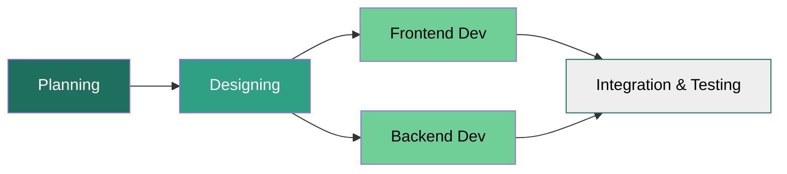
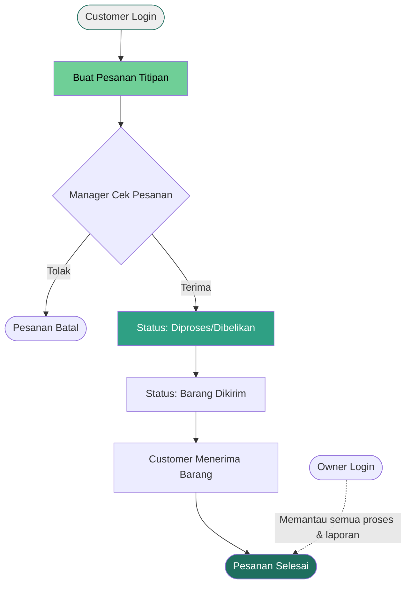
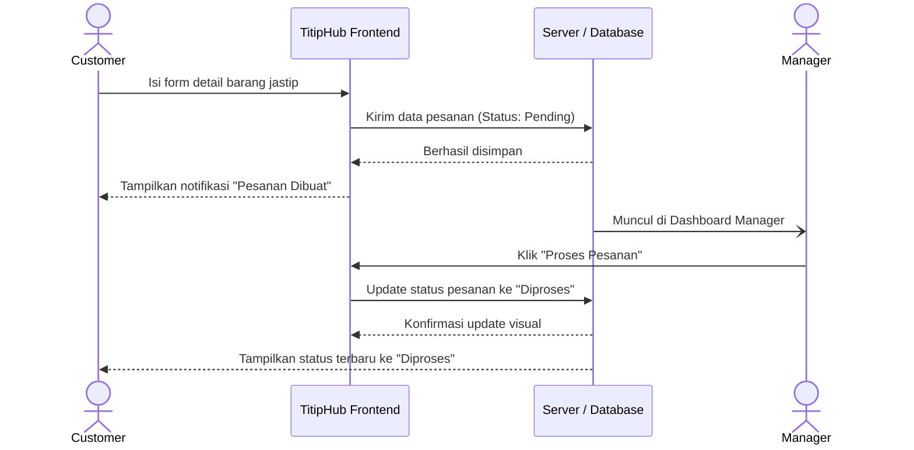
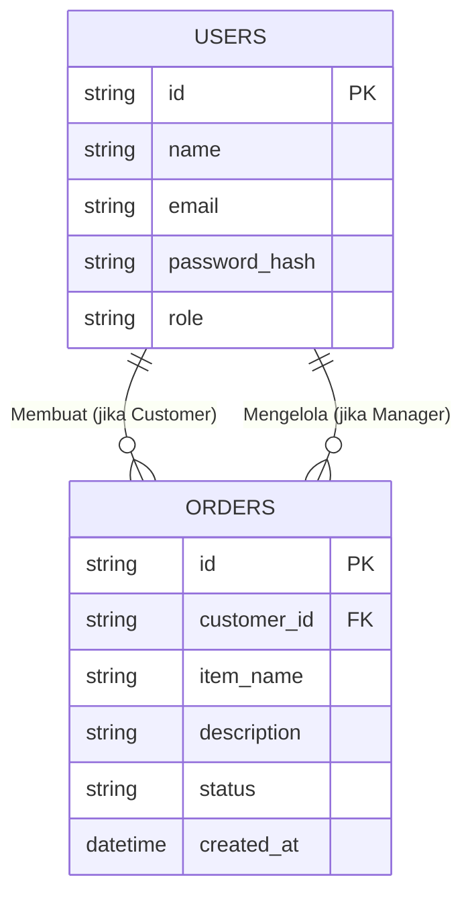

# PRD — Project Requirements Document

## 1. Overview
**TitipHub** adalah sebuah website sistem informasi berbasis *multi-role* (multi-peran) yang dirancang khusus untuk mempermudah operasional usaha jasa titip (jastip) lokal. Masalah utama yang sering dihadapi oleh usaha jastip adalah pencatatan pesanan yang berantakan, kurangnya transparansi status barang bagi pelanggan, dan miskomunikasi antara pemilik dan pengelola (manajer). 

Tujuan utama aplikasi ini adalah menyediakan satu wadah (hub) terpusat, di mana pelanggan (masyarakat setempat) bisa menitipkan pesanan, manajer bisa memperbarui status pembelian dan pengiriman, serta pemilik usaha dapat memantau seluruh aktivitas transaksi. Aplikasi ini dirancang untuk skala kecil hingga menengah dengan target pengguna aktif kurang dari 100 orang.

## 2. Requirements
Persyaratan utama dalam pengembangan aplikasi **TitipHub** meliputi:
- **Sistem Akun Multi-Role:** Harus mendukung 3 jenis pengguna (Owner, Manager, dan Customer) dengan hak akses yang berbeda-beda.
- **Desain UI/UX Khusus:** Aplikasi harus menerapkan identitas warna khusus yang memberikan kesan profesional namun segar, yaitu Hijau Gelap (`#1F6F5F`), Hijau Tosca (`#2FA084`), Hijau Muda/Aksen (`#6FCF97`), dan Abu-abu Terang untuk latar belakang (`#EEEEEE`).
- **Performa Ringan:** Karena target pengguna di bawah 100 orang, sistem dioptimalkan untuk responsivitas dan biaya pemeliharaan server yang rendah.
- **Siklus Pengembangan Terstruktur:** Mengikuti *flow* pengembangan standar produk perangkat lunak.

**Diagram Proses Pengembangan (*Development Process Flow*):**

## 3. Core Features
Berikut adalah fitur-fitur utama berdasarkan masing-masing peran pengguna:

**Untuk Customer (Masyarakat Setempat):**
- **Formulir Jastip:** Halaman untuk memasukkan detail barang yang ingin dititip (nama barang, foto referensi, jumlah, dan catatan khusus).
- **Pelacakan Status (Tracking):** Pemantauan status pesanan secara *real-time* (Contoh: Menunggu Konfirmasi -> Sedang Dibelikan -> Barang Dikirim -> Selesai).

**Untuk Manager (Pengelola Jastip):**
- **Manajemen Pesanan:** Dashboard untuk menerima atau menolak pesanan yang masuk dari *Customer*.
- **Pembaruan Status:** Fitur untuk mengubah status barang letika sudah dibeli atau sedang dalam proses pengiriman ke pelanggan.

**Untuk Owner (Pemilik Usaha):**
- **Master Dashboard:** Halaman rekapitulasi untuk melihat total pesanan, performa jastip, dan riwayat transaksi secara keseluruhan.
- **Manajemen Pengguna:** Fitur untuk menambahkan akun tingkat *Manager* atau membekukan akun yang bermasalah.

## 4. User Flow
Langkah-langkah di bawah ini menggambarkan perjalanan pengguna yang paling utama, yaitu proses pemesanan barang hingga selesai.

1. **Customer** masuk ke platform dan mengisi form titipan barang.
2. Pesanan masuk ke dalam sistem dengan status "Menunggu Konfirmasi".
3. **Manager** login, melihat daftar pesanan baru, dan "Menerima" pesanan tersebut.
4. **Manager** membelikan barang dan mengubah status menjadi "Barang Diproses".
5. Setelah barang siap diserahkan/dikirim, **Manager** mengubah status menjadi "Siap Diambil/Dikirim".
6. **Customer** menerima barang dan pesanan ditandai sebagai "Selesai".
7. **Owner** dapat melihat rekapan proses ini melalui laporannya.

**Diagram User Flow:**

## 5. Architecture
TitipHub menggunakan arsitektur **Client-Server**. *Frontend* (antarmuka yang dilihat pengguna) akan berkomunikasi dengan *Backend* (server logika dan database) menggunakan API REST. Arsitektur ini memisahkan tanggung jawab secara jelas: **React.js** menangani perenderan antarmuka, routing, dan manajemen state di sisi klien, sementara **Node.js/Express.js** menangani logika bisnis, autentikasi, validasi data, dan interaksi dengan database. Pemisahan ini meningkatkan skalabilitas, memudahkan *testing* unit untuk masing-masing lapisan, serta memberikan fleksibilitas dalam strategi deployment.

**Sequence Diagram (Proses Pemesanan & Update Status):**

## 6. Database Schema
Untuk memenuhi kebutuhan sistem di bawah 100 pengguna, kita hanya memerlukan struktur database yang sangat sederhana namun efektif. Terdapat dua tabel utama: `Users` (Pengguna) dan `Orders` (Pesanan Titipan).

**Daftar Tabel dan Kolom:**

1. **Users** (Menyimpan data akun)
   - `id` (String/UUID) -> ID Unik pengguna.
   - `name` (String) -> Nama lengkap pengguna.
   - `email` (String) -> Email untuk login.
   - `password_hash` (String) -> Kata sandi yang sudah dienkripsi.
   - `role` (Enum) -> Peran pengguna (Owner, Manager, Customer).

2. **Orders** (Menyimpan data barang titipan)
   - `id` (String/UUID) -> ID Unik pesanan.
   - `customer_id` (String/UUID) -> Relasi ke tabel Users (Pemesan).
   - `item_name` (String) -> Nama barang yang dititip.
   - `description` (Text) -> Penjelasan detail atau URL referensi barang.
   - `status` (String) -> Status saat ini (Pending, Diproses, Dikirim, Selesai, Batal).
   - `created_at` (Datetime) -> Waktu pesanan dibuat.

**ER Diagram (Entity-Relationship):**

## 7. Tech Stack
Mempertimbangkan kebutuhan kecepatan pengembangan, pemisahan tanggung jawab (*separation of concerns*), dan kemudahan bagi *developer* untuk menskalakan aplikasi di masa depan, berikut adalah rekomendasi teknologi terbaik:

- **Frontend Library & Build Tool:** **React.js** dikombinasikan dengan **Vite**. Vite menyediakan lingkungan pengembangan yang sangat cepat dengan *Hot Module Replacement* (HMR) dan proses *build* yang dioptimalkan, cocok untuk aplikasi berskala menengah.
- **Styling UI:** **Tailwind CSS** dikombinasikan dengan komponen dari **shadcn/ui**. Pengaturan warna pada Tailwind akan disesuaikan secara khusus dengan kode aksen yang telah ditentukan:
  - `primary`: `#1F6F5F` (Warna utama / Header)
  - `secondary`: `#2FA084` (Tombol aksi utama)
  - `accent`: `#6FCF97` (Elemen sukses / highlight)
  - `background`: `#EEEEEE` (Warna dasar latar belakang web)
- **Backend Framework:** **Node.js** dengan **Express.js**. Express.js dipilih karena sifatnya yang minimalis, ringan, dan fleksibel dalam membangun RESTful API yang akan dikonsumsi oleh frontend React.
- **Database:** **SQLite** (Sangat ringan, tidak butuh server database terpisah, sangat lebih dari cukup untuk <100 pengguna).
- **ORM (Penghubung Database:** **Drizzle ORM** (Ringan, penulisan mudah, dan aman dari tipe data/TypeScript).
- **Autentikasi (Sistem Login):** **Better Auth** atau **JWT (JSON Web Token)**. *Better Auth* direkomendasikan untuk integrasi modern dan pengelolaan sesi/kuki yang lebih aman, sedangkan JWT menjadi alternatif standar industri untuk validasi *stateless* antara frontend dan backend.
- **Deployment:** Frontend dapat di-*deploy* menggunakan Vercel/Netlify, sementara Backend dapat dijalankan di layanan seperti Render, Railway, atau VPS. Komunikasi antara kedua lapisan diatur melalui variabel lingkungan (*environment variables*) dan CORS yang dikonfigurasi dengan tepat.