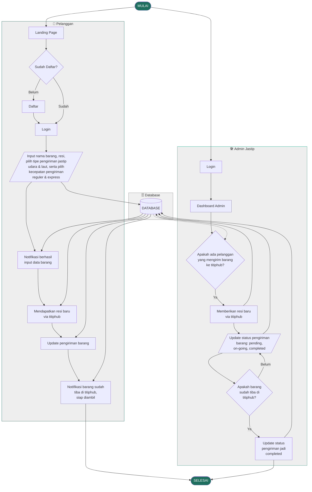

# Alur Sistem TitipHub — Penjelasan Lengkap

> Dokumen ini menjelaskan secara rinci alur sistem TitipHub berdasarkan diagram alur (*system flow*) yang telah dirancang, mencakup dua aktor utama: **Pelanggan** dan **Admin Jastip**, serta interaksi keduanya dengan **Database** terpusat.

---

## Gambaran Umum

Sistem TitipHub melibatkan tiga komponen utama yang bekerja bersama:

| Komponen | Peran |
|---|---|
| **Pelanggan** | Pengguna yang menitipkan barang melalui platform |
| **Admin Jastip** | Pengelola yang memproses dan memperbarui status pengiriman barang |
| **Database** | Penyimpanan terpusat untuk semua data pengguna dan pesanan |

---

## Diagram Alur Sistem



---

## Detail Alur: Sisi Pelanggan

### 1. Akses Landing Page
Pelanggan membuka platform TitipHub dan tiba di halaman utama (*Landing Page*). Di sini pelanggan akan dihadapkan dengan pilihan untuk masuk atau mendaftar.

### 2. Pengecekan Status Pendaftaran
Sistem mengecek apakah pelanggan sudah memiliki akun:
- **Belum Daftar** → Pelanggan diarahkan ke halaman **Daftar** untuk membuat akun baru, kemudian lanjut ke halaman **Login**.
- **Sudah Daftar** → Pelanggan langsung menuju halaman **Login**.

### 3. Input Data Barang
Setelah berhasil login, pelanggan mengisi formulir pengiriman barang dengan detail berikut:

| Field | Keterangan |
|---|---|
| **Nama Barang** | Nama atau deskripsi singkat barang yang dikirim |
| **Resi Pengiriman** | Nomor resi dari ekspedisi asal pengiriman barang |
| **Tipe Pengiriman Jastip** | Pilihan jalur: **Udara** atau **Laut** |
| **Kecepatan Pengiriman** | Pilihan layanan: **Reguler** atau **Express** |

### 4. Notifikasi Berhasil Input Data
Setelah data berhasil dikirim ke sistem, pelanggan menerima **notifikasi konfirmasi** bahwa data barang telah berhasil diinput ke platform TitipHub.

### 5. Mendapatkan Resi Baru via TitipHub
Setelah Admin memproses barang yang masuk, pelanggan menerima **resi baru dari TitipHub** sebagai nomor pelacakan internal untuk memantau perjalanan barang selanjutnya.

### 6. Update Pengiriman Barang
Pelanggan dapat memantau **pembaruan status pengiriman** barangnya secara real-time melalui platform, mulai dari *pending*, *on-going*, hingga *completed*.

### 7. Notifikasi Barang Tiba
Ketika barang telah tiba di titik penerimaan TitipHub, pelanggan mendapatkan **notifikasi bahwa barang sudah tiba dan siap diambil**. Ini menandai selesainya proses dari sisi pelanggan.

---

## Detail Alur: Sisi Admin Jastip

### 1. Login Admin
Admin Jastip masuk ke sistem menggunakan kredensial akun yang telah didaftarkan.

### 2. Dashboard Admin
Setelah login, Admin diarahkan ke **Dashboard Admin** yang menampilkan seluruh aktivitas dan data pesanan yang masuk dari pelanggan.

### 3. Pengecekan Kiriman Baru
Admin secara aktif memantau apakah **ada pelanggan yang mengirimkan barang ke TitipHub**:
- **Ada kiriman baru** → Admin melanjutkan ke langkah pemberian resi.
- **Tidak ada** → Admin menunggu dan terus memantau dashboard.

### 4. Pemberian Resi Baru via TitipHub
Ketika barang fisik diterima di TitipHub, Admin **membuat dan menerbitkan resi baru TitipHub** untuk barang tersebut. Resi ini diteruskan ke pelanggan melalui sistem.

### 5. Update Status Pengiriman
Admin memperbarui status pengiriman barang secara berkala sesuai kondisi aktual:

| Status | Keterangan |
|---|---|
| `pending` | Barang terdaftar, menunggu diproses |
| `on-going` | Barang sedang dalam proses pengiriman |
| `completed` | Barang telah tiba di tujuan / siap diambil pelanggan |

### 6. Pengecekan Kedatangan Barang
Admin mengecek apakah **barang sudah tiba di lokasi TitipHub**:
- **Sudah tiba** → Admin mengubah status menjadi `completed`.
- **Belum tiba** → Admin terus memperbarui status sesuai perkembangan.

### 7. Update Status Menjadi Completed
Setelah barang dipastikan tiba, Admin **mengubah status akhir menjadi `completed`**, yang memicu notifikasi otomatis ke pelanggan bahwa barang siap diambil.

---

## Peran Database dalam Sistem

Database berfungsi sebagai **pusat penyimpanan dan distribusi data** yang menghubungkan aksi pelanggan dengan respons admin secara sinkron:

- Menyimpan data pesanan yang diinput pelanggan.
- Menjadi sumber data bagi Admin untuk memantau kiriman baru.
- Menyimpan resi baru TitipHub yang diterbitkan Admin.
- Mendistribusikan pembaruan status ke tampilan pelanggan secara real-time.
- Mencatat status akhir (`completed`) sebagai rekam jejak transaksi.

---

## Ringkasan Status Pesanan

```
[Pelanggan Input Data] 
        ↓
   [PENDING] ← Barang terdaftar, menunggu diproses admin
        ↓
  [ON-GOING] ← Admin memproses & barang dalam pengiriman
        ↓
 [COMPLETED] ← Barang tiba di TitipHub, siap diambil pelanggan
```

---

## Perbedaan dengan User Flow Sebelumnya (PRD v1)

Diagram alur sistem yang baru ini memperkenalkan beberapa **pembaruan konsep** dibanding user flow awal di PRD:

| Aspek | PRD Awal | Alur Sistem Baru |
|---|---|---|
| **Fokus pesanan** | Barang yang ingin *dibeli/dititip belikan* | Barang yang sudah dimiliki pelanggan dan ingin *dikirim/dijastip* |
| **Resi** | Tidak disebutkan | Pelanggan memasukkan resi asal; Admin menerbitkan resi TitipHub baru |
| **Tipe pengiriman** | Tidak ada | Udara & Laut; Reguler & Express |
| **Konfirmasi Admin** | Terima / Tolak pesanan | Admin menerima barang fisik dan menerbitkan resi TitipHub |
| **Notifikasi pelanggan** | Status berbasis teks | Notifikasi aktif saat input berhasil & barang tiba |

---

*Dokumen ini merupakan bagian dari spesifikasi teknis proyek TitipHub. Untuk detail arsitektur dan tech stack, lihat `prd.md`.*
